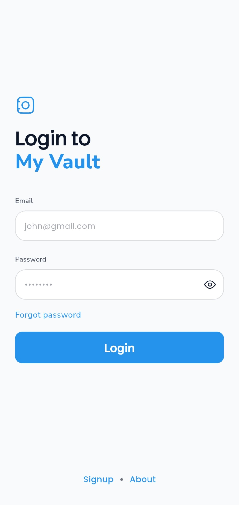
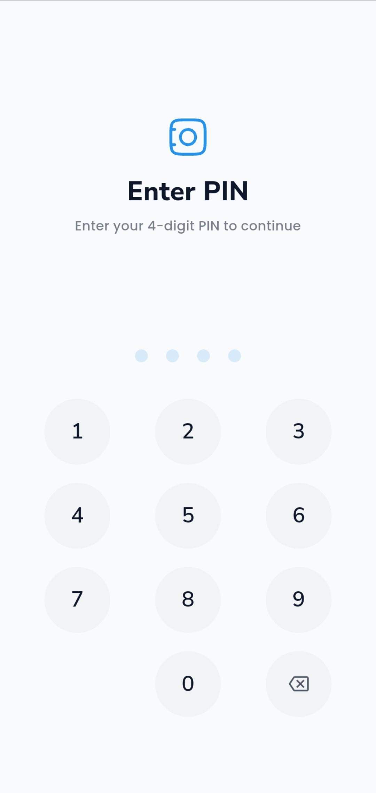
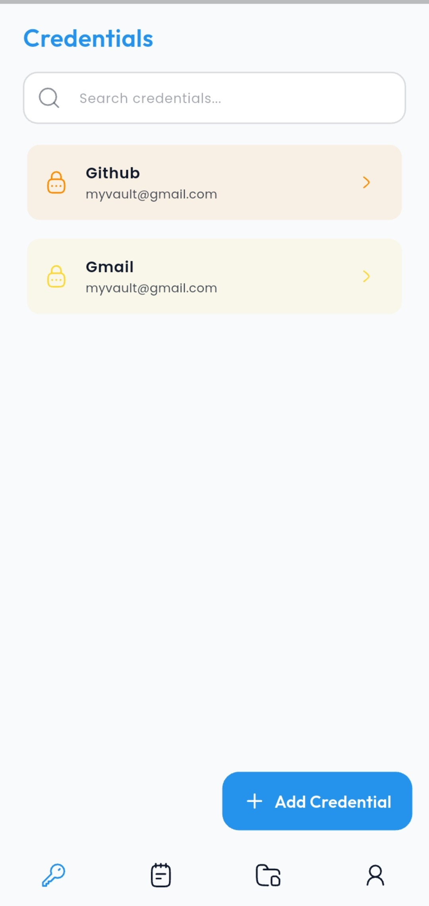
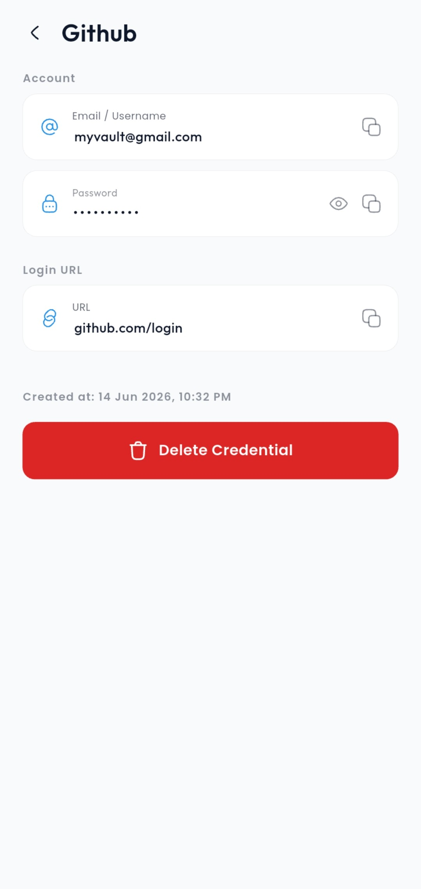
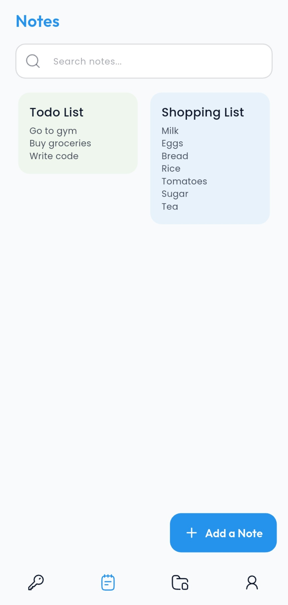
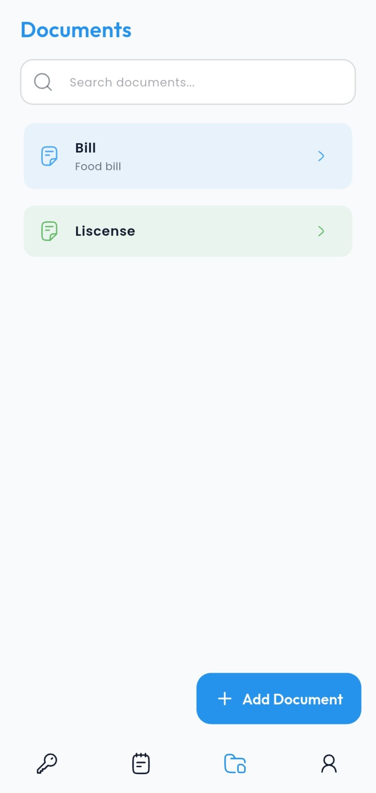
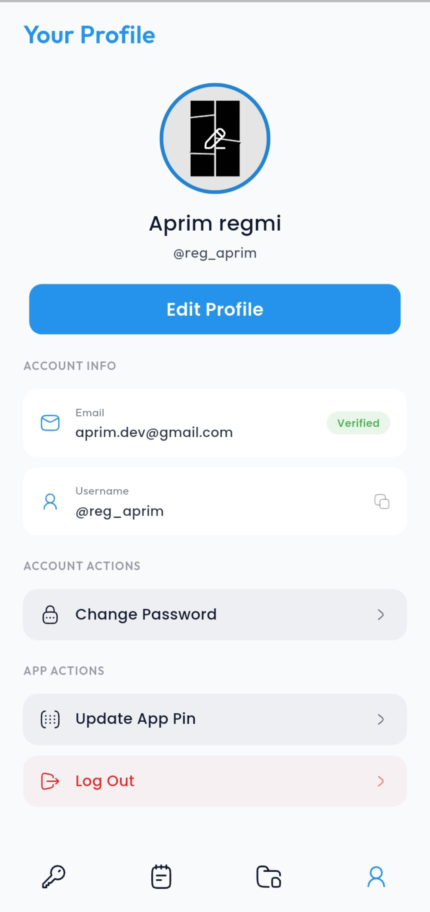

  

A simple and secure app to store your passwords, private notes, and important documents. It uses a fast Go backend and strong server encryption to keep your personal data completely safe.

---

## What is My Vault?

My Vault helps you organize your digital life without worrying about data leaks. It splits your data into three simple sections:

* **Credential Manager** A safe and easy place to save your website logins, emails, and passwords in a secure list.
* **Notes Manager** A private space to write down personal notes, thoughts, or sensitive text info that nobody else can read.
* **Documents Manager** A secure folder to upload your important files, receipts, or photos. The app encrypts the file links automatically for extra safety.

---

## Security Architecture

Your privacy is the most important part of this project. Here is how your data stays safe:

* **Strong Server Encryption** Your passwords and notes are fully encrypted using strong industry standards (AES-256-GCM) on our server before they are ever saved to the database.
* **Fast Go (Golang) Backend** The backend is written entirely in Go. This makes the app process your data quickly and securely, while keeping the system safe from outside attacks.
* **Shielded Media Storage** Your uploaded documents and photos are safely stored on Cloudinary. To keep them private, the web links pointing to your files are fully encrypted in our database.

---

## Screenshots

  
  &nbsp;&nbsp;&nbsp;&nbsp;
  
  &nbsp;&nbsp;&nbsp;&nbsp;
  
  &nbsp;&nbsp;&nbsp;&nbsp;
  
  &nbsp;&nbsp;&nbsp;&nbsp;
  
  &nbsp;&nbsp;&nbsp;&nbsp;
  
  &nbsp;&nbsp;&nbsp;&nbsp;
  

